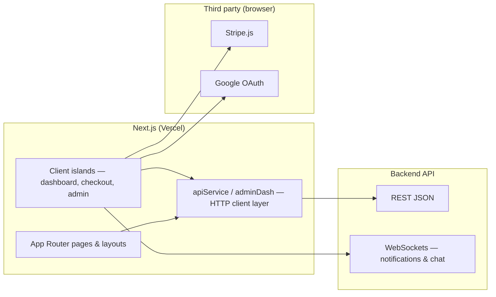

<p align="center">
  <strong>ClassEasily</strong><br />
  <em>Web application &amp; host experience</em>
</p>

<p align="center">
  <a href="#overview">Overview</a> ·
  <a href="#architecture">Architecture</a> ·
  <a href="#product-surfaces">Surfaces</a> ·
  <a href="#what-makes-this-hard">Complexity</a> ·
  <a href="#engineering-highlights">Highlights</a> ·
  <a href="#quality">Quality</a>
</p>

<p align="center">
  
  
  
  
  
  
  
</p>

---

## Overview

**ClassEasily** helps small experience businesses take bookings, get paid, and stay in touch with customers—without enterprise CRM bloat. This repository is the **customer-facing and host-facing web app**: marketing and SEO pages, authentication, the full **business dashboard**, guest checkout and inbox, an **admin operations console**, Stripe-powered payments, and tooling around the **embeddable booking widget**.

The **Django REST API**, workers, WebSockets, and AWS deployment live in the companion backend repository (`backend`).

> **Portfolio note:** This codebase is published to show product UI engineering at scale. It is not a starter kit or actively maintained OSS template.

---

## Architecture

The app is a **Next.js App Router** project that talks to a remote API. Server components and route-level metadata support SEO; client components handle interactive dashboards, checkout, and realtime-adjacent flows. State is split intentionally: remote server state via **TanStack Query**, UI/session state via **Redux Toolkit**, and Stripe via **Elements** wrappers.



---

## Product surfaces

| Surface | Role |
|---------|------|
| **Marketing** | Homepage, pricing, fees, policies, about, blog with categories/tags and structured metadata |
| **Host onboarding** | Registration, email verification, Stripe Connect return handling, SaaS-style signup wizard |
| **Business dashboard** | Tabbed workspace: services, schedule, bookings, students/CRM, payouts, reviews, widget customizer, email marketing, memberships, staff, settings |
| **Public business profile** | Slug-based host pages and join flows for marketplace discovery |
| **Guest** | Booking funnels, payment steps, cancellation/reschedule, **guest inbox** (magic-link conversations) |
| **Gift cards & corporate** | Dedicated checkout and shortlist flows for higher-touch sales |
| **Widget demo** | Sandboxed embed experience for themed booking UI |
| **Admin** | Permission-gated tabs: users, businesses, bookings, payments, payouts analytics, support, metrics |

Each surface reuses shared design language but enforces different **permission and plan gates** aligned with backend subscription models.

---

## What makes this hard

| Area | Why it is non-trivial |
|------|------------------------|
| **Dashboard breadth** | Dozens of tabs and workflows (scheduling, bulk class ops, payout CSV export, marketing campaigns) share one shell without turning into an unmaintainable mega-component tree. |
| **Checkout correctness** | Stripe PaymentIntents, saved payment methods, express pay, free bookings, gift cards, and post-payment polling must stay consistent with backend state machines. |
| **Widget story** | Hosts customize colors/fonts and embed on **their** domains; the app must explain, preview, and enforce subscription tiers that mirror backend addon logic. |
| **Auth overlays** | Password reset, invite, claim-account, and verify-email flows are routed as **overlays** on the marketing shell for smooth deep links without losing context. |
| **API surface** | The central `apiService` module alone spans **thousands of lines**—typed endpoints for business, guest, widget, and admin—reflecting the same ~700-route backend inventory. |
| **Legal & trust** | Long-form policy pages (terms, privacy, cookies, content) ship as structured content components, not throwaway static HTML. |
| **Performance awareness** | Bundle analysis script, chunk-load tests, dynamic imports on the homepage, and Vercel analytics/speed insights hooks. |

---

## Engineering highlights

### Data fetching strategy

TanStack Query caches list/detail endpoints for dashboards (bookings, payouts, students) with invalidation tuned to mutation flows. Heavy admin tables use dedicated service modules (`adminDash.js`) separated from host APIs to keep permission boundaries obvious in code review.

### Stripe in the browser

Checkout steps isolate **Elements** providers, client-secret handling, and error recovery (including helpers to derive PaymentIntent IDs from secrets for analytics). Corporate and gift-card flows reuse patterns but different UX constraints.

### Dashboard composition

The business dashboard uses catch-all routing (`dashboard/[...tab]`) so every tab is deep-linkable—important for notifications and email CTAs that land on payouts, bookings, or widget settings.

### Admin as an app-within-an-app

Admin routes share a tab config driven by **backend permission codenames**, so the UI never exposes actions the API would reject.

### Observability

Sentry for Next.js captures client and server errors; marketing pages set canonical URLs and Open Graph metadata for production SEO.

---

## Quality

| Layer | Tooling |
|-------|---------|
| **Lint** | ESLint with persistent cache for fast CI/local runs |
| **E2E** | Playwright (`test:e2e`, Chromium project) |
| **Unit-style** | Node test runner for widget-docs accuracy and chunk-load behavior |
| **Build** | Prebuild scripts generate location/collection presets used across explore UI |

---

## Repository map (selected)

```
src/app/                 # App Router — marketing, business, admin, guest, widget-demo
src/components/          # Shared UI, marketing chrome, dashboard widgets
src/services/            # apiService, adminDash — HTTP boundary to backend
src/lib/                 # Plans, analytics helpers, shared constants
scripts/                 # Build-time data generation
```

---

## Related repository

**Backend:** Django REST API, Celery, Channels, Stripe webhooks, Typesense, Terraform/ECS. See `backend`.

---

<p align="center">
  <sub>Built as a portfolio showcase — a production-shaped UI for scheduling, payments, CRM, and embedded commerce.</sub>
</p>
